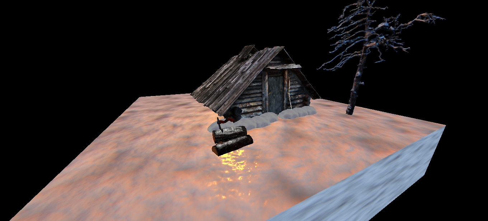

# Cenário Nórdico com Three.js
<!--- --->




> Trabalho final da disciplina de Computação Gráfica - Ciência da Computação/Bloco VI - UESPI (2023)

## 🎯 Metas

#### O projeto ainda está em desenvolvimento e as próximas atualizações serão voltadas nas seguintes tarefas:

- [x] Presença de no mínimo 10 objetos, sendo obrigatório a inserção de pelo menos <br> um modelo importado para o Three.js (25% da nota)
- [ ] Presença de no mínimo uma animação (15% da nota)
- [x] Uso de texturas em pelo menos 3 objetos (10% da nota)
- [x] Permitir a manipulação da câmera utilizando o mouse (10% da nota)
- [x] Permitir o redimensionamento da tela e fullscreen (10% da nota)
- [x] Presença de no mínimo 3 fontes luminosas (além da ambiente) (10% da nota)
- [ ] Presença de sombras (10% da nota)
- [x] Hospedagem do cenário no vercel e envio do repositório no github (10% da nota)

## 💻 Pré-requisitos

#### Baixar o [Node.js](https://nodejs.org/en/download/).

## 🚀 Instalando <trabalhofinal-cg-bloco6>

#### Para instalar siga estas etapas:

> No terminal
  
* #### Verifique e instale todas as dependências (execute esse primeiro)
```
npm install
```   
* #### Inicie o servidor local em http://localhost:5173/
```
npm run dev
```

## ☕ Usando <trabalhofinal-cg-bloco6>

* #### Utilize o mouse para mover e dar zoom. 
* #### Na direita você verá uma caixa de controle para interagir com as luzes do ambiente.

## 🤝 Colaboradores

<table>
  <tr>
     <td align="center">
      <a href="#">
        <br>
        <sub>
          <b>João Vinicius</b>
        </sub>
      </a>
    </td>
    <td align="center">
      <a href="#">
        <br>
        <sub>
          <b>Júlia Meneses</b>
        </sub>
      </a>
    </td>
  </tr>  
</table>

## 📝 Licença

#### Esse projeto possuí licença livre.
#### Todos os matériais usados são de licença gratuita.
  
* [Dragão](https://sketchfab.com/3d-models/demon-dragon-5c3d6dd81b294988bd7a839b7e2b5c5f)
* [Cabana](https://sketchfab.com/3d-models/forest-hut-e17b4bbf60e24d27beb4c0e69e3e4768)
* [Raio](https://sketchfab.com/3d-models/thunder-5628e538d9e34f32a3d05a6b076ade07)
* [Machado God of War](https://sketchfab.com/3d-models/leviathan-axe-god-of-war-50143f73601246f2916e571df854b978)
* [Rocha com neve](https://sketchfab.com/3d-models/free-asset-snowy-rock-01-d97d4f6d5b6d45a2aa77000eb1234118)
* [Tronco de madeira](https://sketchfab.com/3d-models/snow-covered-logs-d058e451a1a846c69d03b499506b31ac#download)
* [Tronco morto](https://sketchfab.com/3d-models/snow-covered-deadwood-269e5c5fd2bf44f48f180f76d2d77439)
* [Textura de neve](https://3dtextures.me/2018/02/26/snow-001/)
* [Música Tema](https://www.youtube.com/watch?v=NSHR5lolVsc&ab_channel=IvanDuch)

